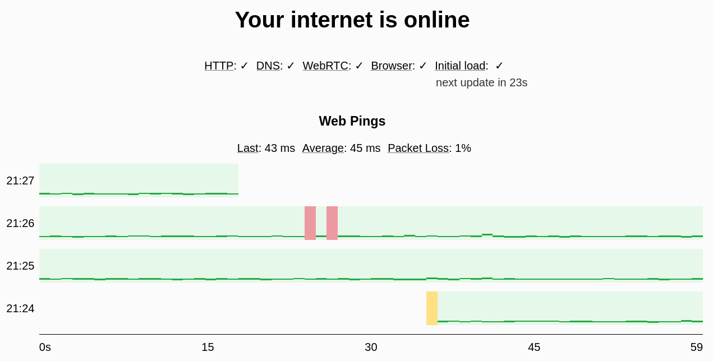

# [Pinging.net](https://www.pinging.net)

Pinging.net quickly determines if you are online by running multiple tests. It then continues to
monitor your connection via repeated tests including a "web ping" every second to help identify
intermittent network issues.

## Project goals

- Reliable. Do not make the user guess if the website isn't loading because of their internet or if
  the website is down.
- Fast website. Do not make the user wait, even on a slow connection. Time to first paint, total
  page size, and time to first test result should all be minimal.
- Provide multiple tests that all work with just the browser.
- Possible to understand test results for non-technical users.
- Provide concise educational descriptions and links to learn more.
- Allow for hosting outside of pinging.net (e.g. on private clouds).

Non-goals (currently):

- Speed test. There are many websites that provide this and the hosting costs would increase
  dramatically.

## The Tests

### Web Ping

A Web Ping is sent every second.
<a href="https://en.wikipedia.org/wiki/Ping_(networking_utility)">Ping</a> is a common network
testing utility. A packet is sent to a computer over the network which replies with a response
packet. If and how fast a response is received help determine network connection quality. Normally
ping packets are sent using the
<a href="https://en.wikipedia.org/wiki/Internet_Control_Message_Protocol">ICMP</a> protocol but
that is not possible from a web page. Instead a
<a href="https://en.wikipedia.org/wiki/WebRTC">WebRTC</a> data channel message is sent to and
returned from the server.
<a href="https://en.wikipedia.org/wiki/User_Datagram_Protocol">UDP</a> is used for the underlying
transport mechanism so dropped messages are not retried which is desired in order to determine
packet loss.

The round trip time of each ping is graphed as a dark green horizontal line for each second. It is
also displayed in milliseconds for the last received ping and the average for all successful
pings.

Packet loss is when a ping response is not received. It is graphed as a red square. The percent of
all pings that were lost is also displayed. Packet loss is caused by many different factors and
potentially indicates issues with your internet connection.

### HTTP Test

Makes a HTTP POST request with a random string body and verifies it is returned properly. Caching of
the request is also explicitly disabled. This test is run every 30 seconds.

### DNS Test

Test DNS is working by making a HTTP GET request to a [random-number]dns-check.pinging.net.
Caching is explicitly disabled and the random number part of the subdomain prevents common caching
of the DNS lookup. This test is run every 30 seconds.

### Browser Check

Web browsers report if they believe you are offline. If this check is failing it means you are
likely not connected to your WiFi, cellular connection or ethernet cord. This is a basic check and
it will often pass even if you are not connected. This check is continuously monitored by your
browser.

### Initial Load Check

Caching is disabled for this site so if this site loads it is a strong indication your internet is
working at the time of loading the site.

<!-- Please verify if changes to text should also be changed in about.html -->

## Architecture

The backend is a single binary written in Rust that handles static file serving, APIs (including
WebRTC), and www and https redirects. The frontend is static html and TypeScript. Pinging.net is
deployed to inexpensive virtual private servers in multiple data centers and a DNS load balancer
(currently CloudFlare) is used to route traffic to the closest server.

Since there is no protocol level load balancer (e.g. HTTP/WebRTC) or reverse proxy (e.g. no nginx),
deployments are done by spinning up a new server and switching the DNS load balancer to use the new
IP. The old IP is kept running for an hour to allow DNS caches to update and existing clients to
refresh to the new server.

## Building and Running

Ensure the following dependencies are installed:

- rust
- nodejs
- npm
- jq

Then run scripts/build (build only), scripts/run_locally (build and run locally), or scripts/deploy
(build then deploy to IP address).

Currently only Linux is tested. I am open to contributions to help with developing or running on
other platforms.

## Contributing

Contributions are welcome. Thanks in advance for your help.

## Acknowledgements

Thanks to all of the authors of the dependencies and utilities that made pinging possible.

## License and Copyright

Licensed under [Apache-2.0](http://www.apache.org/licenses/LICENSE-2.0). Copyrights are retained by
their contributors.
